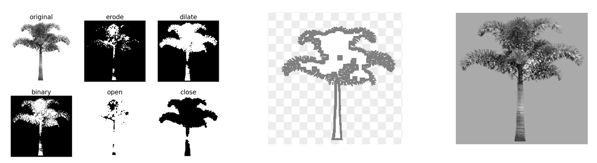

# introduction

Some naive python codes for removing the white background of images.

These codes were used to change the background color of some white-background object pictures.

I'll try to refine the code and write some instructions about how to use them by the end of September! 